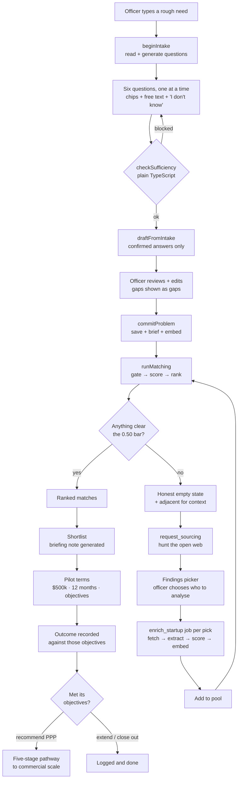

# StartupBridge — how it is built

A two-sided matchmaking platform pairing development-focused startups with
public-sector problem statements. A program officer describes a need in their
own words; the system interrogates that need, writes it up using only what the
officer confirmed, scores the approved pool against it, and — when nothing
measures up — goes hunting the open web. Officers can also browse the pool as
a menu of solutions, and take a chosen startup all the way through a funded
pilot to a public-private partnership at commercial scale.

This document explains how the whole thing works and why it is shaped the way
it is. It is written for whoever operates or extends it next.

- **Live:** `https://startupbridge-tpbq.vercel.app`
- **Code:** `github.com/naitikpj47/startupbridge`
- **As of:** commit `d6cdb80`, 13 Aug 2026

---

## Contents

1. [The one constraint](#1-the-one-constraint)
2. [Shape of the system](#2-shape-of-the-system)
3. [Data model](#3-data-model)
4. [The anti-fabrication doctrine](#4-the-anti-fabrication-doctrine)
5. [The Ask flow](#5-the-ask-flow)
6. [Scoring and matching](#6-scoring-and-matching)
7. [The job queue and enrichment pipeline](#7-the-job-queue-and-enrichment-pipeline)
8. [Demand-driven sourcing and the findings picker](#8-demand-driven-sourcing-and-the-findings-picker)
9. [Briefing notes](#9-briefing-notes)
10. [The solutions menu](#10-the-solutions-menu)
11. [Pilots and the pathway to scale](#11-pilots-and-the-pathway-to-scale)
12. [Public surface, auth and security](#12-public-surface-auth-and-security)
13. [Configuration and operations](#13-configuration-and-operations)
14. [Testing — what was actually run](#14-testing--what-was-actually-run)
15. [Build history](#15-build-history)
16. [Known issues and unverified paths](#16-known-issues-and-unverified-paths)
17. [Extending it](#17-extending-it)

---

## 1. The one constraint

Everything else follows from this: **the tool must never fabricate.**

Program officers forward its output onward. A plausible invented sentence in a
government-facing document is worse than a gap, because a gap is visible and an
invention is not. The original version took *"I need something that helps
decrease malaria in Thailand"* and produced five confident sentences about
border provinces, migrant labour and drug resistance. None of it came from the
officer, and the embedding, the matching and the briefings all inherited it.

That failure is why the system now looks the way it does:

| Mechanism | Where |
|---|---|
| A model's claim to have "captured" something is discarded; only a verified substring of the officer's own message survives | [§4](#4-the-anti-fabrication-doctrine) |
| "Is there enough to draft?" is decided by plain TypeScript, never by a model | [§4](#4-the-anti-fabrication-doctrine) |
| Unknown scores as *unknown*, not as zero — it leaves the denominator | [§6](#6-scoring-and-matching) |
| Every extracted field carries a provenance rank, and low-rank values flag rather than block | [§7](#7-the-job-queue-and-enrichment-pipeline) |
| An empty result is a publishable finding, not a failure to hide | [§6](#6-scoring-and-matching) |

---

## 2. Shape of the system

### Stack

| Layer | Choice |
|---|---|
| Framework | Next.js **16.3.0** (App Router, Turbopack, Server Actions), React **19.2.8** |
| Styling | Tailwind **v4** with `@theme` design tokens |
| Database | Supabase — Postgres + **pgvector**, Auth, row-level security |
| Generation | Anthropic SDK `^0.116.0`, default model `claude-sonnet-4-6` |
| Embeddings | OpenAI `text-embedding-3-small`, **1536** dimensions |
| HTTP | `undici` `^8.10.0` (needed for the SSRF-guarded fetcher — **Node 20+**) |
| Hosting | Vercel (Hobby) + hosted Supabase (Tokyo, `aws-0-ap-northeast-1`) |

### Size

| | |
|---|---|
| TypeScript / TSX | 69 files, ~11,900 lines (including tests) |
| SQL migrations | 13 files, ~1,580 lines |
| Tables | 15, all with RLS enabled |
| Enums | 16 |
| Job types | 8 |
| Test assertions | 91 across 4 suites |

### Live data at time of writing

21 problems · 96 startups · 165 matches · 288 jobs · 1 pilot

### The flow



There is a second way in, for officers who would rather browse than ask: the
**solutions menu** ([§10](#10-the-solutions-menu)) is the whole pool behind
sixteen filters, and a startup picked from there enters the same
shortlist → pilot → pathway arc.

### Two surfaces

| | Public | Officer |
|---|---|---|
| Routes | `/`, `/submit`, `/robots.txt` | `/status`, everything under `/dashboard` |
| Auth | none | Supabase Auth + `team_members` allowlist |
| DB access | **zero table grants**; one validated RPC | RLS-scoped session client, service role for machinery |
| Rate limit | 5/hour per IP | 300/hour on the worker tick |

---

## 3. Data model

Thirteen migrations, applied in filename order. Every table has RLS enabled.

### Tables

| Table | Purpose |
|---|---|
| `team_members` | Email allowlist. **The authorization root** — every RLS policy calls `is_team_member()` against it. |
| `country_regions` | 104 rows mapping ISO-2 → region, used for partial geographic credit. |
| `problems` | Problem statements. Carries `embedding`, `enriched_brief`, `intake_answers`, `open_questions`. |
| `startups` | The company. `domain` is `unique` and is the dedupe key everywhere. |
| `startup_profiles` | Everything derived: `profile_text`, `embedding`, `base_readiness`, `data_confidence`, `field_provenance`, `metrics`. One row per startup (`unique` FK). |
| `affiliations` | University / accelerator links, with a `verified` boolean that gates the institutional-backing signal. |
| `matches` | One row per (problem, startup). Holds all four scores plus workflow state. |
| `pilots` | Terms for a funded pilot on one match — budget, window, objectives — then outcome and the PPP pathway. `match_id` is **unique**: the pilot *is* that pairing's next step, so a re-run is an edit, not a second row. |
| `outreach` | Contact log per match. |
| `scoring_config` | **Single row.** Every tunable weight and threshold. |
| `jobs` | The work queue. |
| `rate_limits` | `(bucket, ip_hash, window_start)` counters. |
| `claim_codes` | Hashed 6-digit codes for founders claiming a scraped listing. |
| `scrape_runs`, `sourcing_runs` | Audit trail for automated discovery. |

### Enums

```
startup_source          self_serve | scraped | referred | csv_import
startup_status          submitted | under_review | approved | rejected
poc_status              none | pilot_completed | deployed_in_field
infra_intensity         plug_and_play | moderate | heavy
data_confidence         high | medium | low
org_type                university | research_institute | accelerator | gov_lab
affiliation_relationship spinoff | incubated | cohort | research_partner
problem_status          draft | open | matching | closed
match_status            suggested | shortlisted | introduced | engaged | dropped
pilot_status            drafted | agreed | underway | completed | cancelled
pilot_outcome           met_objectives | partial | not_met
scale_decision          recommend_ppp | extend_pilot | close_out
outreach_response       pending | interested | declined
sourcing_status         running | completed | failed
job_status              queued | running | succeeded | failed
job_type                enrich_startup | recompute_startup | embed_startup |
                        enrich_problem | embed_problem | generate_briefing |
                        prefill_url | source_candidates
```

### Nullability *is* the doctrine

```sql
gov_experience boolean,   -- NULL = unknown; false = confirmed no (the NULL vs ZERO rule)
poc_status public.poc_status,        -- nullable for the same reason
infra_intensity public.infra_intensity
```

This is not incidental. The distinction between *unknown* and *confirmed
absent* is enforced in the DDL so it cannot be lost downstream.

### Security model

The `anon` role has **literally zero surface**:

- RLS on all 15 tables, and no anon policy exists anywhere.
- `revoke all on all tables/sequences/functions in schema public from anon`.
- Four `alter default privileges ... revoke` statements, so future objects
  inherit nothing.
- Exactly one grant to a non-service role in the whole schema:
  `is_team_member()` to `authenticated`.

```sql
create function public.is_team_member() returns boolean
  language sql stable security definer set search_path = ''
as $$ select exists (
  select 1 from public.team_members tm
  where tm.email = lower(coalesce(auth.jwt() ->> 'email', ''))
) $$;
```

Eleven tables share one blanket policy (`for all to authenticated using
(is_team_member()) with check (is_team_member())`) — `pilots` among them, since
officers write pilot terms directly through their own session rather than
through machinery. `team_members` and `jobs` are SELECT-only — *the queue is
machinery, not data*. `rate_limits` and `claim_codes` have RLS enabled and
**zero policies**: deny-all to everyone but the service role.

> Every function is created `set search_path = ''` to prevent search-path
> hijacking of a `SECURITY DEFINER` function. That is why pgvector's operator
> must be written `operator(extensions.<=>)`.

### Notable RPCs

| Function | What it does |
|---|---|
| `submit_startup(jsonb)` | The entire public intake path, atomically. Validates 14 fields, dedupes on domain, tags provenance, inserts, enqueues. Returns `{status}` — `invalid`/`claimable`/`duplicate`/`submitted` — and **swallows exceptions** so a caller learns nothing exploitable. |
| `claim_next_jobs(int)` | Buries orphans, then claims with `FOR UPDATE SKIP LOCKED`. See [§7](#7-the-job-queue-and-enrichment-pipeline). |
| `problem_similarities(uuid)` | `1 - (sp.embedding operator(extensions.<=>) p.embedding)`. Returns `status` rather than filtering, so one RPC serves both the engine and threshold calibration. |
| `request_sourcing(uuid)` | Collapses duplicate hunts — refreshes an existing queued job to the front instead of inserting a second. |
| `append_review_flags`, `merge_field_provenance` | jsonb accumulation done in SQL so parallel workers cannot clobber each other with read-modify-write. |
| `check_rate_limit(...)` | Window counter. |
| `process_recompute_queue()` | pg_cron sweep — **enqueues** work, never calls an external API. |

---

## 4. The anti-fabrication doctrine

Three enforcement points, deliberately layered so no single prompt is load-bearing.

### 4.1 Read — a claim is not a capture

`readAsk()` asks the model, for each of six dimensions, whether the officer's
message already established it. The model must return a `quote`: the exact
substring justifying its claim. Then the server checks it:

```ts
const quoted =
  d?.quote && ask.toLowerCase().includes(d.quote.toLowerCase().trim())
    ? d.quote
    : null;
```

If the quote does not literally appear in what the officer wrote, the capture
is discarded. And the model's `captured` restatement — unverifiable prose that
can widen meaning — is **thrown away entirely**. The UI pre-fills with the
verified substring, nothing else. `captured: quoted`.

> Because a pre-filled value arrives already selected, an unverified widening
> would silently become "something the officer said."

### 4.2 Gate — decided in code, not by a model

```ts
const MIN_ANSWER = 2;
const REQUIRED: DimensionKey[] = ["problem", "where"];
const NEED_ONE_OF: DimensionKey[] = ["who", "today", "constraints", "success"];
```

A model asked *"is this enough?"* says yes under mild pressure. This is the one
decision that must not be negotiable, so `checkSufficiency()` is plain
TypeScript. You need what is wrong, roughly where, **and at least one lived
detail**. Topic plus place is a label, not a problem:

> *"That's a topic and a place, but not yet a problem. Add one lived detail —
> who it hits, what's already been tried, or what would count as working."*

`MIN_ANSWER` is 2 rather than 3 by deliberate correction: the gate blocks
emptiness, not brevity. `UK` is a real answer.

The same function runs in the browser for live feedback and again on the server
before drafting — *the client copy is for the progress bar, not for permission.*

### 4.3 Draft — silence is a gap

```ts
export function unansweredDimensions(answers: IntakeAnswer[]): DimensionKey[]
```

Three states collapse to one: declared unknown, left blank by pressing Next,
and absent from the array. All are "not established". An earlier version
counted only declared unknowns, so a question skipped with **Next** vanished
and the draft prompt was told *"Nothing is missing"* about things nobody had
answered.

The gaps go into the prompt as an explicit do-not-fill list, come back as
`open_questions`, and are stored on the problem row and rendered in a warning
block for the life of that problem.

The draft system prompt is written defensively:

> *An incomplete statement that is entirely true is useful. A complete
> statement containing one invented detail is worse than nothing, because a
> program officer will send it onward believing it is theirs.*

### 4.4 Provenance is persisted

`problems.intake_answers` (jsonb) and `problems.open_questions` (text[]) store
both halves — what was confirmed and what was not — so any brief can be audited
back to what a human actually said.

---

## 5. The Ask flow

Three server actions, one phase machine.

| Action | Model calls | Writes | Purpose |
|---|---|---|---|
| `beginIntake(ask)` | 1 | none | Understand; generate six questions with suggested options |
| `draftFromIntake(ask, answers)` | 1 | none | Re-run the gate server-side; draft from confirmed facts only |
| `commitProblem(draft, answers)` | 2 | problem + matches | Save, brief, embed, match, hunt if nothing clears |

`AskBox` phases: `ask → reading → intake → working → done`, plus **`stuck`**.

### The six dimensions

| Key | Label | What it establishes |
|---|---|---|
| `problem` | The problem | What is actually going wrong |
| `where` | Where | Country, region, the kind of place |
| `who` | Who it hits | Who bears the cost today |
| `today` | What's tried | Current approach and where it breaks |
| `constraints` | Constraints | What a solution has to survive |
| `success` | What good looks like | How you'd know it worked |

Each renders as a hand-drawn SVG mark in a progress rail — target, pin, people,
cycle, shield, flag — so the rail reads as part of the page rather than stuck
onto it. A distinct dashed `Gap` glyph marks a declared unknown, visually
different from a question not yet visited.

### Why one question at a time

> Six cards stacked on a page is a form, and people fill forms in as few words
> as possible. One question, with the reason it matters and four things they
> might say, gets real answers — and every one of those answers is theirs.

The model proposes 4–5 concrete, field-realistic options per question. **An
option is an offer, not a fact.** It enters the record only when clicked. The
prompt bans statistics and named organisations outright.

### The `stuck` state

A failed commit used to drop the officer back to an empty ask box, losing six
answers and a reviewed statement to one rate-limit. Now the draft and answers
are held in the phase, the statement is displayed, and retry is one click that
re-derives nothing.

### Server actions return unions, never throw

A thrown Server Action error reaches the browser stripped of its message (React
error #441), telling the officer nothing. Every action returns
`{failed: true, message}`; `friendlyAskError()` maps the real cause to
something actionable, and the detail goes to the server log.

### Loading screen

`askForFacts()` runs `claude-haiku-4-5` **in parallel, never awaited before the
real work** — context cards land in ~2s while the pipeline takes ~20s. Failure
returns `[]`; it must never cost the officer their answer. The prompt hard-bans
statistics: *"never state a statistic, percentage, count, year, or monetary
figure."*

---

## 6. Scoring and matching

Four components fused by weights that live in the single-row `scoring_config`.
There is **no in-code fallback** for weights — a missing config throws.

### 6.1 base_readiness — the NULL-vs-ZERO rule

Six independent signals:

| Signal | Max | Scores full marks when |
|---|---|---|
| `gov_experience` | 25 | boolean is `true` |
| `poc` | 15 | `deployed_in_field` (10 for `pilot_completed`) |
| `infra` | 10 | `plug_and_play` (5 for `moderate`) |
| `institutional_backing` | 20 | at least one **verified** affiliation |
| `funding` | 15 | tiered: >$5M→15, ≥$1M→10, >0→5, =0→0 |
| `team_size` | 10 | tiered: >20→10, ≥6→6, ≥0→2 |

```
base_readiness = round(100 * earned / sum_of_max_of_KNOWN_signals)
```

**NULL drops out of the denominator. A confirmed zero stays in it.** Zero known
signals → `null`, never `0`.

> Scoring an unmeasured field as 0 would manufacture a negative finding out of
> missing data — indistinguishable from a measured failure. Encoding it as a
> denominator change means an unknown makes the score *less precise*, not
> *worse*.

PoC and infra are two independent signals, never one composite — a composite
would let a known infra value mask an unknown PoC value inside a single
denominator slot, defeating the rule.

`tierPoints()` re-sorts tiers descending before its first-match-wins walk, so a
reordered edit to the dashboard-editable JSON cannot silently change scores.

**`data_confidence`** counts signals whose provenance is in
`{reviewer_confirmed, founder_provided, premium_db}` — ≥5 `high`, ≥3 `medium`,
else `low`. It is displayed beside the score and **never blended into it**.

### 6.2 THE GATE

One shared `evaluateGate()` called by every matching surface.

**Excluded outright:** `poc_status === 'none'` or `infra_intensity === 'heavy'`.

**NULL passes, flagged.** A passing value whose provenance is `scraped` or
`ai_inferred` also passes flagged. Flags are typed `verify_before_intro` and
travel with the startup into the briefing note.

Excluded startups keep `status = 'approved'` — the gate is a matching filter,
not a verdict. Both exclusion causes return one shared constant:

```ts
export const HELD_COPY =
  "Held until PoC confirmed — submit proof-of-concept evidence " +
  "(pilot partner, location, results) to become matchable.";
```

The founder is never told "your infrastructure is too heavy" — only the
actionable path.

### 6.3 The other three components

**`similarity`** — pgvector cosine, computed in SQL as `1 - distance`. Clamped
to `[0,1]` before storage.

**`context_fit`** — three sub-signals, each entering the denominator only when
known (the NULL rule again): geography 40 (exact country hit 40, same region
25), sector 35, SDG overlap 25.

**`strategic_fit`** — a policy weight on HQ country, normalized against the
observed maximum. Current weights: `JP 10, KR 8, CA 5, AU 3, default 0`.

### 6.4 final_score

```
weight_similarity 0.35 · weight_readiness 0.30 · weight_context 0.20 · weight_strategic 0.15
```

Evidence components renormalize; **policy never does.** `base_readiness` and
`context_fit` contribute their weight to both numerator and denominator only
when non-null. `strategic_fit` always contributes 0.15 to both.

> If partnership priority renormalized away for an unknown HQ, a startup with
> no recorded HQ would score *higher* than an identical one confirmed in a
> zero-priority country.

And a hard assertion, because a refactor forgetting the `1 -` would silently
invert every ranking:

```ts
throw new Error(
  `similarity must be a finite number in [-1, 1], got ${x} — was a distance or NULL passed?`
);
```

### 6.5 Thresholds and adjacency

`similarity_threshold` is **0.50**, calibrated on the live matrix.

`rankedMatches()` re-checks `approved` status and re-runs the gate on every
read, so a startup gated since the last run never resurfaces. Matches are
ordered by `final_score desc`.

The adjacent fallback fires **only when zero matches clear the bar**, and sorts
by *similarity*, not final_score — a startup can have a high final score from
readiness and policy while being topically irrelevant. Limit 3.

`runMatching()` throws if the problem has no embedding: *an un-embedded problem
must never masquerade as "no matches".* An empty result is a publishable
finding; a broken pipeline is not.

The match upsert payload deliberately omits `status`, `rationale`,
`briefing_note` and outreach columns, so a re-run structurally cannot clobber
an officer's workflow state or a paid-for briefing.

---

## 7. The job queue and enrichment pipeline

No AI work ever runs inside a request handler. Everything expensive is a row in
`jobs`, drained by `POST /api/worker/tick` (`maxJobs: 3`, `maxDuration = 60`).

### 7.1 Ordering — for a human, not for fairness

```sql
order by
  priority desc,
  (case when priority > 0 then created_at end) desc nulls last,  -- foreground: newest first
  created_at asc                                                  -- background: oldest first
limit batch_size
for update skip locked
```

Foreground work (`source_candidates`, `prefill_url`, priority 10) is **newest
first**, because the most recent explicit request is the one someone is
actually waiting on. An abandoned ten-minute-old hunt must not beat the one an
officer is watching. Background work stays oldest-first so nothing starves.

This ordering was rewritten across two migrations after a real failure: hunts
were completing fine but sat behind 25+ auto-queued enrichment jobs under
strict FIFO, so the button looked broken.

### 7.2 Reliability

| Mechanism | Value |
|---|---|
| Retry backoff | linear — 30s, 60s, 90s (`30_000 * attempts`) |
| Max attempts | 3 |
| Stale lease | 15 minutes, then re-claimable |
| Orphan burial | `attempts >= max_attempts` past the lease → `failed`, error `worker lost; attempts exhausted` |
| Status-write retry | 4 attempts, sleeping `1500 * attempt` ms |

### 7.3 enrichStartupFromWebsite — the whole chain in one job

Fetch the site → extract a profile with Claude → apply values under provenance
rules → **`recomputeStartup()` → `embedStartup()`**. One job per candidate is
all it takes to make them scoreable, which is what the findings picker relies
on.

### 7.4 SSRF defences

The fetcher was hardened after review found several bypasses:

- **DNS-pinned undici `Agent`** — the hostname is resolved once and the
  connection pinned, defeating DNS rebinding.
- **Manual redirect walk** — every hop re-validated, so a redirect cannot
  escape to a private address.
- Blocks `::ffff:127.0.0.1`-style IPv4-mapped addresses and trailing-dot hosts
  (`localhost.`).
- **Streamed byte cap** so an endless response cannot exhaust memory.

### 7.5 Provenance

```
reviewer_confirmed > founder_provided > premium_db > scraped > ai_inferred
```

Everything the AI extracts enters at `ai_inferred` and may only fill nulls or
overwrite equal-or-lower-rank values. Anything unverifiable becomes a
`review_flags` entry rather than a silently written field. Flags dedupe in SQL
on `(type, field, detail)` — excluding `raised_at`, so "the same thing about
the same field" is the same flag whenever it was raised.

---

## 8. Demand-driven sourcing and the findings picker

### 8.1 The hunt

When nothing clears the bar, `request_sourcing()` queues one hunt at priority
10 (collapsing duplicates onto a single job).

The fast path: Haiku writes 4 search queries → **parallel** web search → the
main model screens the results. Provider precedence is
`bing → brave → serper → tavily`, first key wins; `PER_QUERY = 8`,
`TIMEOUT_MS = 12_000`, `Promise.allSettled` so one failing query never sinks
the batch, URLs de-duped.

Without a search key it falls back to Anthropic's built-in `web_search`, which
searches *sequentially* and takes many minutes. **With a key: ~28 seconds.**
That difference is the whole reason the abstraction exists.

Screening had to be rewritten once: the first version returned five NGOs and
charities. The prompt now uses commercial vocabulary, bans institutional words,
and applies an explicit test — *"would this organisation invoice a client?"*

### 8.2 The findings picker

Hunt results land **on the problem they were run for**, never in the global
review queue. The queue is an undifferentiated inbox of every self-serve
submission, CSV import and past hunt; sending an officer there to find the six
companies just found for the problem in front of them is the wrong
destination.

Each candidate shows the deployment evidence that got it picked, its domain and
HQ, and a checkbox. **Nothing is scored until the officer ticks it** — analysis
is a site fetch plus a model call plus a re-embed, so running it on everything
by default spends real money on companies nobody has looked at. The UI states
the price inline. *Judgement first, spend second.*

Server-side, `analyseCandidates()` re-checks ownership against `sourced_for`
and filters candidates already in flight, so a double-click cannot double-spend.

### 8.3 `analysed` is completion, not score

```ts
const analysed = simByStartup.has(r.id); // embedded ⇔ analysed
```

The marker has been wrong twice, and both times a test caught it, so the
history is worth keeping. `base_readiness` is NULL after a fully successful
analysis (website enrichment writes none of the six readiness signals), so
keying off it made every paid analysis report "never analysed" — rows reverted
to unticked checkboxes and could be paid for again forever. The first fix,
`profile_text`, looked right but is rebuilt by *any* recompute: the pg_cron
sweep wrote it for candidates whose sites were never fetched, which the live
findings test caught on its next run.

The embedding is the artifact only the end of the analysis chain produces, and
it is also the point of the exercise — analysed means scoreable, scoreable
means embedded. The similarity RPC returns exactly the embedded rows, so
presence in its result is the flag. Readiness stays NULL and displays as `—`,
which is the honest answer.

### 8.4 Failures are visible

**Roughly two in five sourced domains are unreachable.** A failed analysis used
to be indistinguishable from one that never ran — the spinner vanished and the
officer could pay again to watch nothing happen. The latest failed job per
candidate is now read from the queue and rendered on the row:

> *Couldn't analyse this one — their site didn't respond. You can still open it
> and judge from the evidence above.*

---

## 9. Briefing notes

Generated when a match is **shortlisted**, stored on the match, never
regenerated per view.

Two parallel calls sharing one system prompt: rationale at `max_tokens: 300`,
briefing at `max_tokens: 1800`. Separate calls because a truncated briefing
should not cost the rationale — and `firstText()` throws distinctly on
`refusal`, `max_tokens` and `model_context_window_exceeded` rather than storing
a half-document.

The note has fixed sections: the problem, the startup, evidence of
deployability, fit analysis (**including what does not fit**), verify before
introduction (fed by the gate's own flags), and one concrete next step.

Staleness is computed rather than tracked — `briefing_generated_at` compared
against `startup_profiles.updated_at` — so the UI can offer "regenerate".

A real generated example, fact-checked field by field against the database
(23 staff, HQ `KR`, active `['KR','BD','KH']`, readiness 95, similarity 0.5797,
`review_flags: []` — all exact):

> **Gaps and concerns:** The similarity score of 58 is moderate, suggesting the
> match is not straightforward. The Cambodia deployment is district-level; the
> problem brief explicitly requires actionable guidance at the union or village
> level — it is unconfirmed whether the system reaches that granularity…
> Power-outage resilience of siren and IoT components is unstated.

Zero invented figures; institutions referred to generically throughout.

---

## 10. The solutions menu

`/dashboard/startups`, titled in the client's own words: *"a menu of innovative
solutions for development challenges."* The Ask flow serves an officer who
knows their problem; this serves one who wants to see what exists.

### Sixteen facets

| Group | Facets |
|---|---|
| Find | Free text — every word must appear somewhere across name, domain, tagline, description, full profile text, sectors, technologies and SDGs; word order irrelevant |
| Pool | Vetted pool (default) · any status · under review · just submitted |
| Deployability | Matchable (clears [the gate](#62-the-gate)) · held until PoC confirmed |
| What they do | Sector · SDG · Technology |
| Geography | Active-in country · Region · HQ country |
| Evidence | PoC status · Infrastructure need · Readiness band · Data confidence |
| Track record | Government experience · Institutional backing · Funding band · Team size |
| Meta | Source · Sort (readiness / newest / name) |

### Three decisions worth knowing

**The pool loads whole and filters in process.** Tens of rows, not tens of
thousands — one query, every cross-cutting filter, no index planning. This is
what makes an exhaustive facet rail cheap. It stops being the right call in the
low thousands; at that point the same predicates move into SQL, which is why
the engine is written as pure functions over plain rows
(`src/lib/solutions.ts`) rather than woven into the page.

**Facet options derive from the data.** `facetOptions()` collects the distinct
values actually present, so the rail never offers a checkbox that matches
nothing.

**The NULL rule extends to filtering.** Every facet that can be unknown offers
*unknown* as an explicit choice, and a filter for a known value never quietly
matches an unknown one:

```ts
function facetMatch(selected: string[], value: string | null): boolean {
  if (!selected.length) return true;
  if (value === null) return selected.includes("unknown");
  return selected.some((s) => s.toLowerCase() === value.toLowerCase());
}
```

Filtering for field-deployed startups is a question about evidence. A profile
with no evidence is a different answer, not a near-miss. The same logic governs
readiness (`unscored` is its own band, never folded into "below 40"), funding
(a confirmed `$0` is `zero`, never `unknown`) and team size.

One GET form drives the whole rail, so every filtered view is a URL an officer
can send to a colleague. Sorting by readiness puts unscored rows **last** — an
unknown is less precise, not worse, but a ranked list has to put it somewhere
and the honest place is after the measured ones.

---

## 11. Pilots and the pathway to scale

What happens after a match is chosen. One `pilots` row per match, on the
problem page below the match list.

### Designing a pilot

Available on matches at `shortlisted`, `introduced` or `engaged` — a chosen
startup, not a mere suggestion. The officer sets:

| Field | Default | Bounds |
|---|---|---|
| `budget_usd` | **500,000** | > 0, capped at $100M |
| `duration_months` | **12** | 1–60 |
| `started_on` | none | optional `YYYY-MM-DD` |
| `objectives` | seeded (below) | ≥ 1, each with an optional measure |
| `milestones` | none | month must fall inside the window; sorted |

Defaults are a starting point, not a policy — the UI says so.

### Objectives are the officer's words

The only prefill is `seedObjectives()`, which lifts the officer's **own
confirmed intake answer** on *what good looks like*, verbatim, and labels it as
theirs. A `success` dimension marked unknown seeds nothing; a problem predating
the structured intake seeds nothing.

> A pilot agreement is exactly the kind of document that gets forwarded, so
> nothing in it may originate from a model.

This is the same doctrine as [§4](#4-the-anti-fabrication-doctrine), applied at
the point where the tool starts producing commitments rather than analysis.

### Lifecycle

```
drafted → agreed → underway → completed
                 ↘ cancelled
```

Completion requires an outcome — `met_objectives`, `partial` or `not_met` —
plus free-text notes recording what actually happened against each objective.
Two database CHECK constraints hold the shape:

```sql
check (outcome is null or status = 'completed'),
check (scale_decision is null or outcome is not null)
```

An outcome cannot exist on an unfinished pilot, and a scale decision cannot
exist without an outcome to decide on. Completion therefore never goes through
`setPilotStatus` — it goes through `recordPilotOutcome`, which writes both.

### The pathway to commercial scale

A completed pilot takes one decision: **recommend for PPP scale-up**, extend,
or close out. Recommending opens a five-stage tracker:

1. **Evaluate against objectives** — results against each objective, with
   evidence that would satisfy an external reviewer
2. **Government counterpart and mandate** — the implementing agency's
   commitment, and the policy hook the project sits under
3. **PPP model and procurement route** — partnership structure, procurement
   route, the startup's defined role
4. **Financing and risk allocation** — public, private or blended capital, and
   who carries which risk
5. **Procurement to commercial close** — run it, negotiate, hand over

Each stage carries a checkbox and the officer's notes. `pathwayWithStage()`
merges one update into stored jsonb and returns the canonical shape — every
known stage, in order, unknown keys dropped — so a hand-edited or legacy row
cannot accumulate junk. Institutions stay generic throughout; the officer names
their own counterparts in the notes.

### Authorization

Pilots are team data, not machinery, so every write goes through the officer's
RLS-scoped client rather than the service role. Each action calls `ownedMatch()`
first, re-verifying that the match id from the browser really belongs to the
problem id from the browser — the two arrive independently and are not trusted
to agree.

---

## 12. Public surface, auth and security

### Authorization is layered downward

`middleware.ts` refreshes Supabase auth cookies and **never redirects** — no
route is protected at the edge. The app-level check is `requireOfficer()` in
every page and action, and beneath that RLS in Postgres. The app check is *a
courtesy, not the wall.*

Officer pages read through the RLS-scoped session client but switch to the
service-role client for machinery — the jobs queue, `problem_similarities`,
`request_sourcing` — which officers deliberately cannot touch directly. The
line is *machinery versus data*: pilots, matches and problems are the
officer's own records and are written through their session; the queue and the
similarity RPC are plumbing and are not.

### Officer routes

| Route | What it is |
|---|---|
| `/dashboard` | The Ask — the centerpiece ([§5](#5-the-ask-flow)) |
| `/dashboard/problems` | Past asks |
| `/dashboard/problems/[id]` | One problem: brief, open questions, matches, **pilots**, hunt findings |
| `/dashboard/startups` | The solutions menu ([§10](#10-the-solutions-menu)) |
| `/dashboard/startups/[id]` | One startup: brief, evidence, readiness, traction, matches last |
| `/dashboard/queue` | Review queue — the global inbox of everything awaiting vetting |
| `/dashboard/config` | Scoring config editor |
| `/dashboard/import` | CSV import |
| `/status` | Pipeline health |

### Public intake

`POST /api/submit` → `submit_startup(jsonb)`, one atomic validated RPC.

- **Honeypot** field `company_fax`, checked *before* the rate limit and
  returning a convincing fake success — so a bot cannot burn a shared NAT's
  5/hour budget for real founders.
- `allowRequest()` returns **false** when the rate-limit RPC itself errors —
  fail closed on the public surface.
- Claim flow: 6-digit code, sha256-hashed, 15-minute expiry, offered only when
  the existing row is `source='scraped'` and unclaimed, and the email domain
  must exactly match the company domain.

### Headers and indexing

`X-Frame-Options: DENY`, `nosniff`, `strict-origin-when-cross-origin`, HSTS
`max-age=63072000; includeSubDomains; preload`, a restrictive
`Permissions-Policy`, `poweredByHeader: false`.
`robots.ts` allows `/` and `/submit`; disallows `/dashboard`, `/api/`,
`/signin`, `/status`.

### Design tokens

Quiet, editorial, institutional. Warm paper `#fafaf7`, near-black ink `#191916`,
one forest accent `#175a3c`, hairline borders instead of shadows. Fraunces for
display, Inter for text, Geist Mono for figures. Motion is 150–250ms ease-out,
nothing bouncy. All text colours were darkened to clear WCAG AA at 12px
(`--color-ink-faint` 4.9:1, `--color-warn` 5.8:1).

---

## 13. Configuration and operations

### Environment variables

**Required**

| Variable | Purpose |
|---|---|
| `NEXT_PUBLIC_SUPABASE_URL` | Project URL |
| `NEXT_PUBLIC_SUPABASE_ANON_KEY` | Publishable key (anon has zero grants) |
| `SUPABASE_SERVICE_ROLE_KEY` | Bypasses RLS — server only |
| `ANTHROPIC_API_KEY` | Enrichment, briefings, sourcing, intake |
| `ANTHROPIC_MODEL` | Defaults to `claude-sonnet-4-6` in code, but `/status` uses its presence as the "environment ready" signal |
| `OPENAI_API_KEY` | Embeddings only |
| `DASHBOARD_ALLOWLIST_EMAILS` | Consumed by the officer-creation script; the runtime wall is `team_members` |

**Optional** — `BING_SEARCH_API_KEY` (+`BING_CUSTOM_CONFIG_ID`),
`BRAVE_SEARCH_API_KEY`, `SERPER_API_KEY`, `TAVILY_API_KEY`,
`ENRICH_SOURCED_CANDIDATES` (default `false`), `RESEND_API_KEY` + `EMAIL_FROM`,
`SCRAPE_ALERT_WEBHOOK_URL`, `SUPABASE_DB_PASSWORD` (**local only** — migrations
are pushed from a developer machine, keeping the Postgres password out of the
host's blast radius).

### Scripts

```bash
npm run dev      # next dev
npm run build    # next build
npm test         # 91 assertions across four suites
npm run lint     # eslint
```

Operator scripts, all `npx tsx scripts/<name>.ts` **from the repo root**:

| Script | Purpose |
|---|---|
| `worker.ts [--watch] [--max N]` | Drain the queue. `--max` is a **spend control** — AI jobs cost money. |
| `add-officer.ts <email> <pw>` | Add one officer. **Prefer this on a live system.** |
| `create-officer.ts` | Resets the password of *every* email in the allowlist. |
| `run-matching.ts`, `calibrate-matching.ts` | Matching operations |
| `backfill-phase2.ts`, `verify-phase3.ts` | Pipeline backfill and verification |

Migrations:

```bash
npx supabase db push --db-url 'postgresql://postgres.<ref>:<url-encoded-pw>@aws-0-ap-northeast-1.pooler.supabase.com:5432/postgres'
```

Session pooler on port 5432 — the direct database host is IPv6-only.

### Keeping the queue moving

Three mechanisms, deliberately overlapping:

1. **In-app kicks.** Every client component POSTs `/api/worker/tick` after
   enqueueing. On a serverless host nothing drains the queue between sweeps, so
   a button that only enqueues looks broken.
2. **pg_cron** every 15 minutes (`startupbridge-recompute-queue`) — pure SQL
   upkeep inside the database: finds work, un-sticks the queue, **enqueues**
   jobs. It never calls an external API.
3. **Vercel cron** daily at 21:00 UTC (05:00 Asia/Manila). Hobby plans allow
   daily only — see [§16](#16-known-issues-and-unverified-paths).

Long sourcing runs exceed any serverless budget; run those from a machine with
no time limit via `npx tsx scripts/worker.ts`.

---

## 14. Testing — what was actually run

### 12.1 The automated suite

```bash
npm test
```

**91 assertions, four suites, no model calls, runs in seconds.**

| Suite | Assertions | Covers |
|---|---|---|
| `tests/gate.test.ts` | **27** | The sufficiency gate and the gap rule. Hermetic — no database, no network. |
| `tests/solutions.test.ts` | **49** | The menu's filter engine, the pilot sanitizers, the pathway merge, objective seeding. Hermetic. |
| `tests/picker.test.mts` | **7** | The picker's ownership and double-spend guards, against the live database with adversarial input. |
| `tests/findings.test.mts` | **8** | The findings view's derived flags against real data. |

What the gate suite actually asserts:

- Topic + place alone is **blocked**, with the right message.
- One lived detail opens it — verified independently for each of the four
  acceptable dimensions.
- Each required dimension really is required.
- "I don't know" never counts as an answer, even with text present.
- Whitespace and single characters are not answers; **`UK` is**.
- A dimension absent from the array is not silently counted.
- A question skipped with **Next** is still a gap (the regression that let the
  draft be told "Nothing is missing").
- Gaps agree with the gate's own `missing` list.
- `blocking` never names a dimension that is filled.

What the picker suite asserts, with deliberately hostile input:

- A candidate belonging to **another problem** is rejected even when its id is
  smuggled into the array — while the legitimate one survives.
- A startup no hunt found is rejected.
- An unknown UUID is rejected without error.
- An empty selection allows nothing (never "select everything").
- The in-flight filter is a strict subset of owned candidates.
- It **warns** if the candidate count ever exceeds the `.in()` cap of 25.

What the menu and pilot suite asserts, in the same spirit:

- Filtering for deployed-in-field **excludes** unknown PoC; `unknown` is a
  separate, selectable answer; selecting both matches both.
- `gov=unknown` matches only NULL — never a confirmed *no*.
- A bootstrapped `$0` is the `zero` band, never `unknown`. Unscored readiness
  is its own band, never "below 40".
- Band edges hold: 79 is not 80+; exactly $5M is the 1m–5m band.
- Search is case-insensitive, order-independent, and a single missing word
  excludes the row.
- Readiness sort puts unscored **last**, not zeroth.
- Facet options never include a value no row has.
- Pilot sanitizers reject a zero, negative or non-numeric budget, a 0- or
  61-month timeline, and milestones outside the window; junk input returns
  empty rather than throwing.
- `pathwayWithStage()` always returns all five stages in order, preserves
  prior stages across updates, and drops unknown keys from stored jsonb.
- `seedObjectives()` takes the confirmed `success` answer verbatim, and seeds
  **nothing** from an answer marked unknown or a problem with no intake record.

### 12.2 Live end-to-end runs

| Run | Result |
|---|---|
| Full intake on *"I need something that helps decrease malaria in Thailand"* | Gate refused it with a reason; opened after one answer; draft's four sentences each traced to a click; three gaps carried forward |
| Sourcing hunt for that problem | **7 real malaria-diagnostics companies** in ~28s (Access Bio, SD Biosensor, Erada, PocDoc, Aqsens, SORA, Baseimmune) |
| One real candidate analysis (Access Bio) | Fetched, extracted, scored, embedded — similarity **0.390**, readiness legitimately NULL. **This exposed the `analysed` bug.** |
| Forced failure (PocDoc, unreachable site) | Retried 3× with backoff, buried as `failed`, surfaced on the row |
| Briefing generation | Generated; every figure fact-checked against the database; zero fabrications |
| Deployment verification | Signed into the live Vercel site, confirmed 7 candidates / 6 checkboxes / 1 "Add to pool", ticked two boxes → *"Run deep analysis on 2 selected"* |
| Menu filters | `poc=deployed_in_field&sector=health` narrowed 96 rows to exactly 2, with 2 cards rendered; all sixteen facets present in the document |
| Full pilot arc | Designed a pilot → agreed → underway → recorded *met its objectives* → recommended PPP → ticked stage 1 of 5. Every transition persisted and re-read from the database. |

Total AI spend across all live testing: **well under 10¢.**

### 12.3 Adversarial review

A multi-agent review over the picker and intake raised **31 findings**; each was
put to two independent refuters (one on correctness, one on user impact) with
the instruction to default to *refuted* when uncertain. **18 were refuted away;
13 survived.**

The review independently identified the same top defect the live analysis run
had exposed, by tracing which columns enrichment actually writes.

Nine defects were fixed as a result:

| Severity | Defect |
|---|---|
| High | `analysed` could never become true for a hunt candidate |
| High | A failed poll tick read as "analysis finished" — poller and worker kicks died permanently |
| High | First-load failure rendered a permanent shimmer with the error banner unreachable |
| High | `picked` never reconciled — a dismissed candidate stayed selected and got a paid analysis |
| High | Skipped questions vanished from the gaps; the draft was told "Nothing is missing" |
| High | The model's unverified `captured` restatement was pre-selected as a confirmed answer |
| High | A failed commit destroyed six answers and a reviewed draft |
| Medium | A permanently failed analysis was indistinguishable from one never started |
| Medium | "Back to the questions" silently discarded draft edits |

Plus the `MIN_ANSWER` correction (the gate rejected `UK`).

### 12.4 Earlier verification

- Deterministic scoring tests against hand-computed values (Phase 2).
- Threshold calibration on the live similarity matrix (Phase 3) → 0.50.
- A multi-agent migration review before the schema was ever applied.
- Browser E2E on the public intake and claim flow (Phase 4).
- Contrast audit — every token checked for WCAG AA at 12px.
- Name-collision audit: four seed startups collided with real companies and
  were renamed after web verification.

---

## 15. Build history

Seven phases, 25 commits, 11–13 August 2026.

| Phase | Delivered |
|---|---|
| 0 | Scaffold, design tokens, env template, Supabase clients |
| 1 | Schema, DB-enforced allowlist RLS, seed data |
| 2 | Scoring engine, AI pipeline, job queue, backfill |
| 3 | Matching engine, the gate, threshold calibration, briefings |
| 4 | Public site — landing fork, smart intake, claim flow |
| 5 | Internal dashboard with Supabase Auth |
| 6 | The Ask centerpiece, demand-driven sourcing, nightly harvest |
| 7 | Polish, production hardening, deploy |

Then four commits of correction driven by real use:

| Commit | Change |
|---|---|
| `73d7a4d` | Structured intake with a sufficiency gate |
| `3d0209c` | Hunt results land on the problem, not the global queue |
| `418fc0e` | Sourcing reachable even when a problem already has matches |
| `8b217a2` | Nine defects fixed; the test suite added |

And a third round, adding the browse-and-fund half of the product:

| Commit | Change |
|---|---|
| `d6cdb80` | The solutions menu, pilot terms, and the PPP scale-up pathway |

---

## 16. Known issues and unverified paths

Listed plainly because a document that only describes the happy path is a
liability.

### Likely broken

**The Vercel cron probably does nothing.** `vercel.json` targets
`/api/worker/tick`, but that route exports only `POST`. Vercel Cron invokes its
target with **GET**, which would return 405 and silently drain nothing. The
GitHub Actions nightly loop uses `curl -X POST` explicitly and is unaffected, as
are the five in-app kicks. *Fix: add a `GET` export delegating to the same
drain.* Nothing in the repo shows this having been tested end to end.

**`/api/prefill` queues at the wrong priority.** It inserts directly rather than
through `enqueueJob()`, so it lands at the column default `priority = 0` even
though `jobPriority("prefill_url")` returns 10. A public /submit pre-fill
therefore queues behind background enrichment — exactly the failure the
priority migration was written to fix.

### Stale documentation

`DEPLOY.md` §4 still recommends the Pro-plan schedule `*/10 * * * *`. An
operator following it verbatim on Hobby will **break their deploy**.

### Not CI-safe

`npm test` cannot run from a clean checkout. Two of the four suites read
`../.env.local` directly and hardcode the problem UUID
`f808789f-c347-4991-b122-cba8a4f2b3ec`, with non-null assertions on
`"Access Bio"` and `"PocDoc"` that become a TypeError if that seed data changes.
`findings.test.mts` also asserts on mutable live state — re-running the worker
can flip it with no code change — it did exactly that after the pg_cron sweep
rewrote `profile_text`, which is how the second `analysed`-marker bug was
caught. **`tests/gate.test.ts` and `tests/solutions.test.ts` are hermetic**
(76 of the 91 assertions); the two `.mts` suites are not.

### Requires manual setup

The nightly harvest does nothing out of the box: `deploy/nightly-harvest.yml`
must be copied into `.github/workflows/` **through the GitHub web UI** (the CLI
token lacks the `workflow` scope), and `scrapers/sources.yaml` needs real
listing pages with `enabled: true`. All three shipped entries point at
example.com, disabled.

A failing harvest never turns the workflow red — `main()` always returns 0. The
only signal is a webhook POST above 5 failures, and only if
`SCRAPE_ALERT_WEBHOOK_URL` is set (it currently is not). **Silent degradation is
the default failure mode.**

### Sharp edges

- `npx tsx scripts/create-officer.ts` resets the password of **every** email in
  the allowlist. Use `add-officer.ts` on a live system.
- pg_cron scheduling is best-effort — if the extension is unavailable the
  migration only raises a NOTICE and the sweep silently never happens. Verify
  with `select jobname, schedule from cron.job;`.
- Setting more than one search key is silently ambiguous; first match in the
  fixed order wins, with no warning.
- Node 20+ is a hard requirement (undici) but `package.json` has no `engines`
  field, so an older host fails at runtime inside enrichment rather than at
  install.
- Never put a comment key inside a `vercel.json` cron object — unknown
  properties fail the build, not warn.
- The `.in("id", ids.slice(0, 25))` ownership cap truncates silently. The test
  prints a WARN rather than failing.
- Every permanently-failing AI job burns three attempts first. A bad
  `ANTHROPIC_API_KEY` costs 3× the queue before anything settles.

### Still unexercised

CSV import, the config editor's save path, and the nightly scraper (no sources
enabled).

### Demo data in production

The live database carries **one pilot** created while testing the feature: a
$500,000 / 12-month pilot on *Frostvane Systems* (a fictional seed startup) for
the island-provinces cold-chain problem, walked all the way to *recommended for
PPP scale-up* with stage 1 of 5 ticked. It is a useful demo artifact and a
misleading record — delete the row before the platform carries real programme
data.

### Menu scale ceiling

The solutions menu loads the whole pool and filters in memory. Correct at 96
startups; it degrades somewhere in the low thousands, and the profile text
loaded for search is the heaviest part. The filter engine is written as pure
predicates over rows precisely so the same logic can move into SQL when that
day comes — but nothing warns you it has arrived.

### Security

- **`adb123` is the password on a publicly reachable deployment.** Change it.
- `/api/diagnose-env` is labelled temporary and is still live. It is
  officer-gated and leaks only length, first 6 and last 4 characters, and
  bad-character positions — but it is a secret-shape oracle behind one auth
  check. Delete it once the deploy is stable.

---

## 17. Extending it

**Tuning the matching** — everything lives in the single `scoring_config` row,
editable from `/dashboard/config`. Nothing is hard-coded; there is no fallback,
so a malformed edit fails loudly rather than silently reverting.

**Adding a job type** — `alter type public.job_type add value if not exists`,
add the case in `src/lib/jobs.ts`, and decide whether it belongs in the
`FOREGROUND` set in `jobPriority()`.

**Adding a search provider** — implement it in `src/lib/ai/websearch.ts` and add
it to the precedence chain in `activeSearchProvider()`.

**Adding an intake dimension** — append to `DIMENSIONS` in
`src/lib/intake-shared.ts`, add an SVG mark in `dimension-icons.tsx`, extend the
`enum` in `READ_SCHEMA`, and decide whether it belongs in `REQUIRED` or
`NEED_ONE_OF`. The gate, the rail and the gap rule all derive from that one
array.

**Adding a menu facet** — add the field to `SolutionRow`, populate it in the
page's row mapping, add a clause to `matchesFilters()`, add the key to
`parseFilters()` and `activeFilterCount()`, and render a `FacetGroup` or
`FacetSelect`. If the field can be unknown, it **must** offer `unknown`
explicitly — that is the house rule, and `tests/solutions.test.ts` is where you
prove it.

**Changing the PPP pathway** — edit `PPP_STAGES` in
`src/lib/pilots-shared.ts`. Stages are stored by key in jsonb and normalized on
every write, so adding, reordering or renaming is safe: unknown keys from older
rows are dropped on the next merge and missing ones default to not-done. No
migration needed.

**Where to be careful** — anything touching the NULL-vs-ZERO rule, the gate, or
the intake's three enforcement points. Those are the parts that keep the tool
honest, and they are the parts a reasonable-looking refactor will quietly break.
Run `npm test` before and after.
